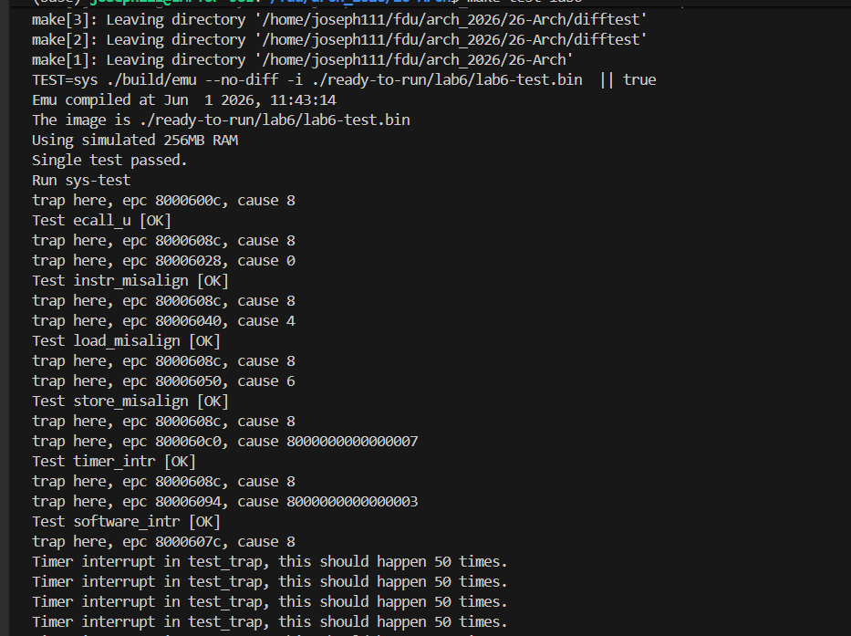
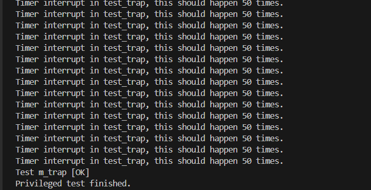
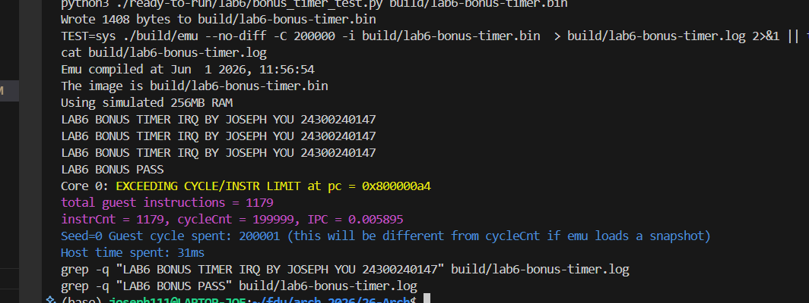

# 计算机组成与体系结构（H）Lab6 实验报告

**尤荣煊 24300240147 2026-05-28**

## 1. 实验目标

本次 Lab6 在 Lab5 已完成的 CSR、特权级切换和 Sv39 MMU 基础上，实现中断与异常支持。根据实验要求，需要支持：

1. 异常：指令地址不对齐、数据地址不对齐、非法指令、`ecall`。
2. 中断：时钟中断、外部中断、软件中断。
3. Trap 进入时更新 `mepc/mcause/mtval/mstatus/mode`，并跳转到 `mtvec`。
4. `mret` 返回时恢复 `mstatus.MIE/MPIE/MPP` 和特权级。
5. 异常/中断发生时清空流水线，并避免不应发出的访存请求。

本次实现保留了 Lab5 bonus 的 load/store page fault 通路，因此缺页异常仍可以通过 MMU fault 注入 WB trap 路径。

## 2. 总体设计

### 2.1 Trap 提交点

CPU 仍采用五级流水：

```text
IF -> ID -> EX -> MEM -> WB
```

所有会改变 CSR 架构态的 trap 操作最终都在 WB 边界提交。这样可以保证 `mepc/mcause/mtval/mstatus` 的更新与指令提交顺序一致，也便于和前序 Lab 的 Difftest 接口保持同一套时序模型。

异常检测分布如下：

| 异常类型         | 检测位置                     |  cause | tval         |
| ---------------- | ---------------------------- | -----: | ------------ |
| 指令地址不对齐   | EX，branch/JAL/JALR 目标地址 |      0 | 目标地址     |
| 非法指令         | EX，decoder 标记后传入       |      2 | 原始指令编码 |
| Load 地址不对齐  | MEM，按访存 size 检查        |      4 | 访存地址     |
| Store 地址不对齐 | MEM，按访存 size 检查        |      6 | 访存地址     |
| ECALL            | WB，按当前特权级编码         | 8/9/11 | 0            |
| Load page fault  | MEM/WB，MMU fault 注入       |     13 | fault VA     |
| Store page fault | MEM/WB，MMU fault 注入       |     15 | fault VA     |

EX 级能确定目标 PC 的异常会提前重定向到 `mtvec`，同时将异常元数据沿流水线带到 WB。访存类异常在 MEM 级发现，直接禁止本周期 `dreq.valid`，并把异常元数据送到 WB 统一进入 trap。

### 2.2 CSR 状态机

`csr_file.sv` 中集中维护 CSR 与当前特权级。进入 M-mode trap 时执行：

```text
mepc          <- trap_pc
mcause        <- trap_cause
mtval         <- trap_tval
mstatus.MPIE <- mstatus.MIE
mstatus.MIE  <- 0
mstatus.MPP  <- trap_priv
mode          <- M
```

如果异常被 `medeleg` 委派到 S-mode，则对应写入 `sepc/scause/stval`，并更新 `SIE/SPIE/SPP`。

`mret` 的行为为：

```text
mstatus.MIE  <- mstatus.MPIE
mstatus.MPIE <- 1
mode          <- mstatus.MPP
mstatus.MPP  <- U
mstatus.XS   <- Off
```

当返回目标不是 M-mode 时，继续清除 `MPRV`，避免 M-mode 访存权限泄漏到低特权级。

## 3. 关键实现

### 3.1 非法指令检测

`decoder.sv` 默认将 `illegal_o` 置 1，只有明确支持的 opcode/funct 组合才清零。这样未实现的指令会自然走非法指令异常，而不是被误解码成 NOP 或普通 ALU 指令。

`id_stage.sv`、`id_ex_reg.sv` 将 `illegal` 标记送入 EX。EX 在 `illegal_i && valid_i` 时：

- `exc_valid_o <- 1`
- `exc_cause_o <- 2`
- `exc_tval_o <- instr_i`
- `redirect_pc_o <- mtvec`

同时屏蔽该指令的寄存器和 CSR 写回。

### 3.2 地址不对齐异常

控制流目标地址在 EX 级检查。branch/JAL/JALR 的实际跳转目标若低两位不为 0，则触发 instruction address misaligned，`mepc` 保存当前指令 PC，`mtval` 保存错误目标地址。

数据访存在 MEM 级按 `mem_size` 检查：

```text
1 byte: 永远对齐
2 byte: addr[0] == 0
4 byte: addr[1:0] == 0
8 byte: addr[2:0] == 0
```

发现 load/store 不对齐后，`mem_stage` 不发出 `dreq.valid`，也不生成 store event。异常元数据进入 MEM/WB 后统一提交 trap。

### 3.3 中断 pending 与 enable

`csr_file.sv` 将外部输入线映射到有效 `mip`：

| 输入      | mip 位 | 含义                       |
| --------- | -----: | -------------------------- |
| `swint_i` |      3 | machine software interrupt |
| `trint_i` |      7 | machine timer interrupt    |
| `exint_i` |     11 | machine external interrupt |

`mip` 和 `sip` 的 CSR 读值都使用这份 effective mip，因此软件轮询 `mip` 时可以看到真实中断线状态。

WB 级执行中断仲裁：

```text
interrupt_enabled = (mode != M) || mstatus.MIE
interrupt_pending = interrupt_enabled && ((mip & mie) has MSIP/MTIP/MEIP)
```

优先级采用 external > software > timer。本实验测试覆盖 timer 和 software interrupt，external interrupt 通路也按同样机制接入。

### 3.4 CSR 写后立即仲裁

调试 `m_trap_test` 时发现，测试程序在 M-mode 中执行：

```asm
csrsi mstatus, 8
int_allow:
csrci mstatus, 8
```

它期望 `csrsi mstatus,8` 提交后立即响应已经 pending 的 timer interrupt，并让 `mepc = int_allow`。如果中断仲裁读取 CSR 写入前的 `mstatus.MIE`，CPU 会晚到下一条 `csrci` 后才响应中断，导致 `mepc` 错误。

最终实现中，WB 仲裁先计算提交 CSR 写入后的 `wb_post_csr_mstatus/mie/mip`，再用这份写后状态判断中断条件。`csr_file` 在同一周期 CSR 写和 trap 同时发生时，也用写后的 `mstatus` 填入 `MPIE/SPIE`。这使行为与 RISC-V 对 CSR 依赖条件“写后立即重新 evaluate”的要求一致。

### 3.5 流水线清空与访存取消

新增 `wb_redirect_valid/wb_redirect_pc` 后，IF 重定向来源变为：

```text
WB trap/interrupt redirect 优先
否则 EX redirect
```

`flush_all` 在 reset、custom trap、WB trap/interrupt 时拉高。对于 MEM 级发现的不对齐访存，`dreq.valid` 在组合逻辑中直接被压低；已经发出的正常访存仍保持原有 `mem_stall` 规则，等待 `data_ok` 后再让流水线前进。

## 4. 调试记录

### 4.1 `m_trap_test` 初始失败

最初版本中，`ecall_u`、地址不对齐、timer interrupt、software interrupt 均已通过，但 `m_trap_test` 输出：

```text
m_trap_test [X]
---TEST FAILED---
```

查看 `ready-to-run/lab6/lab6-test.S` 后发现，`m_test_trap_entry` 会检查：

```asm
csrr t0, mepc
addi t1, ..., int_allow
bne  t0, t1, m_test_trap_fail
```

也就是说中断必须发生在 `csrsi mstatus,8` 提交之后、下一条 `csrci mstatus,8` 执行之前。根因是 WB 仲裁使用了旧的 `csr_mstatus`，没有看到本周期 CSR 写入后的 MIE=1。修复后 Lab6 完整输出 `Test m_trap [OK]` 与 `Privileged test finished.`。

### 4.2 `enable_jtag` 未初始化导致仿真随机 abort

在补充 bonus 测试时，手动运行 `build/emu --no-diff ...` 偶发只打印 `Emu compiled at ...` 后 abort，且尚未进入 `init_ram()`。定位到仿真参数结构体 `EmuArgs` 中 `enable_jtag` 没有默认初始化，导致某些启动路径会随机进入 `remote_bitbang_t(23334)` 初始化；在受限环境中绑定端口失败后直接 abort。

修复方式是在 `difftest/src/test/csrc/verilator/emu.h` 的 `EmuArgs()` 中显式设置：

```cpp
enable_jtag = false;
```

该修复不改变 CPU RTL 行为，只保证不带 `--enable-jtag` 的普通测试启动路径稳定可复现。

## 5. 测试结果

### 5.1 Lab6 官方测试

执行：

```bash
make test-lab6
```

输出：




根据 Wiki 说明，`Privileged test finished.` 出现即为正确。后续程序持续运行或循环输出失败信息属于正常现象，需要手动 `Ctrl+C` 退出。

### 5.2 Bonus：时钟中断处理程序

为使 bonus 可以直接测试，本次新增 `ready-to-run/lab6/bonus_timer_test.py`。它不依赖额外 RISC-V 汇编器，而是直接生成一段 RV64 裸机二进制，入口仍为 `0x80000000`。测试程序完成以下工作：

报告中的等价 C/伪汇编代码如下，实际可运行版本由生成器编码为 RV64 指令：

```c
#define UART_TX    ((volatile unsigned char *)0x40600004)
#define MTIMECMP   ((volatile unsigned long long *)0x38004000)
#define MTIME      ((volatile unsigned long long *)0x3800bff8)
#define MIP_MTIP   (1ull << 7)

static unsigned long long tick_count;

static inline unsigned long long read_mip(void) {
  unsigned long long x;
  asm volatile ("csrr %0, mip" : "=r"(x));
  return x;
}

static void puts_mmio(const char *s) {
  while (*s) *UART_TX = *s++;
}

static void set_timer(unsigned long long delta) {
  *MTIMECMP = ~0ull;
  while (read_mip() & MIP_MTIP) {}
  *MTIMECMP = *MTIME + delta;
}

void timer_trap_entry(void) {
  unsigned long long mcause;
  asm volatile ("csrc mstatus, %0" :: "r"(8));
  asm volatile ("csrr %0, mcause" : "=r"(mcause));
  if (mcause == (0x8000000000000000ull | 7)) {
    *MTIMECMP = ~0ull;
    puts_mmio("LAB6 BONUS TIMER IRQ\n");
    if (++tick_count == 3) {
      puts_mmio("LAB6 BONUS PASS\n");
      while (1) {}
    }
    set_timer(20);
  }
  asm volatile ("mret");
}
```

```asm
mtvec <- timer_trap_entry
mie.MTIE <- 1
mtimecmp <- mtime + 20
mstatus.MIE <- 1
spin

timer_trap_entry:
  save ra/t0/t1/t2/a0
  if mcause != interrupt | 7: mret
  mstatus.MIE <- 0
  mtimecmp <- -1                 # 先清除电平型 trint pending
  puts("LAB6 BONUS TIMER IRQ\n")
  tick_count++
  if tick_count == 3:
      puts("LAB6 BONUS PASS\n")
      spin
  mtimecmp <- mtime + 20         # 重设下一次时钟中断
  restore ra/t0/t1/t2/a0
  mret
```

`set_timer` 的关键点是先向 `0x38004000` 写 `-1` 关闭当前比较器，再轮询 `mip.MTIP` 清零，之后读取 `0x3800bff8` 的 `mtime` 并写入 `mtime + delta`。这样可以避免 `trint` 作为电平信号在 handler 打印期间保持 pending，导致重复进入中断。

对应 Makefile 目标：

```makefile
test-lab6-bonus: export CCACHE_DISABLE=1
test-lab6-bonus: sim
	python3 ./ready-to-run/lab6/bonus_timer_test.py build/lab6-bonus-timer.bin
	TEST=sys ./build/emu --no-diff -C 200000 -i build/lab6-bonus-timer.bin $(VOPT) > build/lab6-bonus-timer.log 2>&1 || true
	cat build/lab6-bonus-timer.log
	grep -q "LAB6 BONUS TIMER IRQ" build/lab6-bonus-timer.log
	grep -q "LAB6 BONUS PASS" build/lab6-bonus-timer.log
```

执行：

```bash
make test-lab6-bonus
```

输出：


该测试通过 grep 强制检查中断 handler 至少打印过 IRQ 信息，并在第三次中断后打印 PASS，说明 handler 能处理中断并重设 `mtimecmp`。

### 5.3 Bonus 相关 Verilog 支撑

时钟中断的外部计时器位于仿真 RAM/MMIO 模型 `difftest/src/test/vsrc/common/ram.sv`：

```systemverilog
u64 mtime, mtimecmp;
trint <= mtime > mtimecmp;
64'h38004000: mtimecmp <= oreq.data;
64'h3800bff8: oresp.data = mtime;
```

CPU 侧在 `csr_file.sv` 把外部线接入 effective `mip`：

```systemverilog
effective_mip[MIP_MTIP_BIT] = trint_i;
assign mip_o = effective_mip;
```

`core.sv` 在 WB 级使用写后 CSR 状态进行中断仲裁：

```systemverilog
wb_post_csr_mip[7] = trint;
wb_interrupt_enabled = (priv_mode != 2'b11) || wb_post_csr_mstatus[3];
wb_interrupt_pending = wb_interrupt_enabled && wb_post_csr_mip[7] && wb_post_csr_mie[7];
wb_interrupt_cause = 64'h8000_0000_0000_0007;
```

进入 trap 时，`csr_file.sv` 写 `mcause/mepc/mtval`，保存 `MPIE/MPP`，清 `MIE` 并切换到 M-mode；`mret` 再恢复 `MIE/MPIE/MPP/mode`。因此 bonus 测试中的 `mtvec/mie/mstatus/mip/mcause/mret` 都走真实 RTL 通路，而不是测试程序自检假象。

### 5.4 为什么时钟中断使用 MMIO 计时器

时钟中断使用外部 MMIO 计时器，而不是 CPU 内部 CSR 或 `mcycle`，主要是因为它代表平台级的 wall-clock 事件，而不是某个 hart 的性能计数：

1. `mtime/mtimecmp` 位于 CPU 外部，即使 CPU 流水线 stall、低功耗暂停、实现乱序或变频，平台时钟仍能按统一节奏前进。
2. `mcycle` 是每个 hart 自己的周期计数器，更适合性能统计；它受 CPU 频率、暂停和微架构行为影响，不适合作为 OS 调度需要的全局时间源。
3. 多核系统需要多个 hart 共享同一个时间基准。外部 MMIO timer 可以作为平台设备统一提供 `mtime`，每个 hart 通过自己的 `mtimecmp` 或中断控制逻辑获得 timer interrupt。
4. MMIO 设计让软件用普通 load/store 访问计时设备，硬件只需把比较结果以电平信号 `trint` 接入 CPU 的 `mip.MTIP`，CPU 本身不必维护庞大的平台计时逻辑。

本项目中这一点也体现在 Verilog 上：`mtime/mtimecmp` 实现在 `ram.sv` 的 MMIO 设备模型中，CPU 只接收 `trint` 并按 RISC-V CSR 规则进入 machine timer interrupt。

### 5.5 回归测试

本次改动后重新验证了前序 Lab：

| 命令                        | 结果                                                                   |
| --------------------------- | ---------------------------------------------------------------------- |
| `make test-lab4`            | `HIT GOOD TRAP at pc = 0x8001fff8`                                     |
| `make test-lab5`            | 输出 `Return from init! Test passed`，随后按测试行为继续运行，手动中断 |
| `make test-lab5-extra-uart` | 输出 `BVhHhSP`，到达 `0x800002b0` 自定义停机位置                       |
| `git diff --check`          | 无空白错误                                                             |

Lab6 的异常和中断实现没有破坏 Lab4/Lab5 的 CSR、特权级和 MMU 行为。

## 6. 上板说明

本次 Lab6 Wiki 明确说明不要求上板测试，因此本报告只记录仿真验证结果。硬件上板相关工作沿用 Lab5 已完成的 Nexys4DDR 工程，不在本次实验范围内修改。

## 7. 总结

本次实验将前序 Lab 中已有的 CSR、特权级、ECALL/MRET 和 MMU fault 通路整合成统一 trap 框架，补齐了同步异常和异步中断：

1. decoder 默认非法，避免未知指令静默执行。
2. EX/MEM 分级检测不同类型异常，并在 WB 统一提交 CSR 状态。
3. interrupt pending 由真实外部线驱动的 effective mip 表示。
4. 中断仲裁使用 CSR 写后状态，修复了 `m_trap_test` 对 `mepc` 的精确时序要求。
5. 数据不对齐异常在 MEM 级直接取消当周期 dreq，满足实验对访存请求的约束。

Lab6 完成后，CPU 已具备基础 RV64 指令、访存、分支跳转、CSR、特权级切换、Sv39 地址翻译、异常与中断处理能力。
